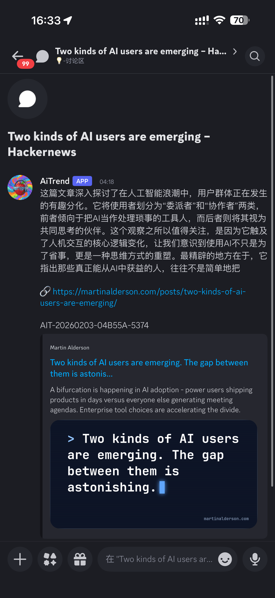
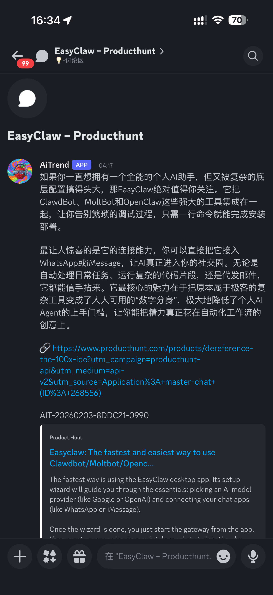
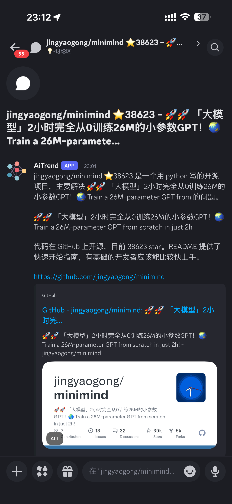
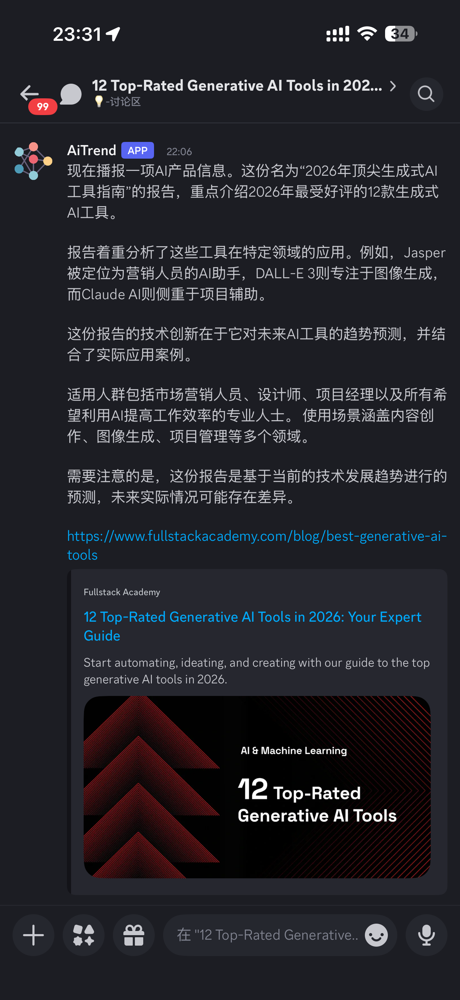

# AiTrend v0.3.0

🔥 **AI Hotspot Discovery Engine** - Automatically collect and publish AI product news

<p align="center">
  <a href="https://github.com/Lychee-AI-Team/AiTrend/actions">
    
  </a>
  
  
  
</p>

<p align="center">
  <b>🌍 Multi-language Docs</b> |
  <a href="README.md">🇨🇳 简体中文</a> •
  <a href="README.en.md">🇺🇸 English</a> •
  <a href="README.ja.md">🇯🇵 日本語</a> •
  <a href="README.ko.md">🇰🇷 한국어</a> •
  <a href="README.es.md">🇪🇸 Español</a>
</p>

---

## 📸 Screenshots

<table>
  <tr>
    <td width="50%" align="center">
      <a href="IMG_1034.PNG">
        
      </a>
    </td>
    <td width="50%" align="center">
      <a href="IMG_1035.PNG">
        
      </a>
    </td>
  </tr>
  <tr>
    <td width="50%" align="center">
      <a href="IMG_1036.PNG">
        
      </a>
    </td>
    <td width="50%" align="center">
      <a href="IMG_1037.PNG">
        
      </a>
    </td>
  </tr>
</table>

<sub align="center">Click thumbnails to view full size</sub>

---

## ✨ Features

- 🧩 **Modular Design** - Combine data sources and output channels freely
- 🤖 **AI Content Generation** - Use Gemini to auto-generate high-quality descriptions
- 📊 **Multi-source Support** - GitHub, Product Hunt, HackerNews, Reddit, Tavily
- 📢 **Multi-channel Publishing** - Discord, Telegram, Feishu
- 🔄 **Auto Deduplication** - 24-hour sliding window prevents duplicates

## 🚀 Quick Start

### Option 1: Manual Install

```bash
git clone https://github.com/Lychee-AI-Team/AiTrend.git
cd AiTrend

# Install dependencies
pip install -r requirements.txt

# Configure environment
cp .env.example .env
nano .env

# Run
python3 -m src.hourly
```

### Option 2: Docker Deploy

```bash
docker-compose up -d
```

### Configuration Requirements

Required environment variables (`.env` file):
- `GEMINI_API_KEY` - Gemini API key
- `DISCORD_WEBHOOK_URL` - Discord Webhook URL

Optional:
- `PRODUCTHUNT_TOKEN` - Product Hunt API token
- `TAVILY_API_KEY` - Tavily API key

## 📁 Project Structure

```
AiTrend/
├── src/                    # Core code
│   ├── __main__.py        # Module entry
│   ├── hourly.py          # Main runtime logic
│   ├── llm_content_generator.py  # LLM content generation
│   ├── sources/           # Data source modules
│   │   ├── base.py
│   │   ├── github_trending.py
│   │   ├── producthunt.py
│   │   ├── reddit.py
│   │   ├── tavily.py
│   │   ├── hackernews.py
│   │   └── twitter.py
│   └── core/              # Core services
│       ├── config_loader.py
│       ├── deduplicator.py
│       └── webhook_sender.py
├── publishers/            # Publisher modules
│   ├── base.py
│   ├── forum_publisher.py
│   └── text_publisher.py
├── tests/                 # Test directory
├── config/                # Configuration files
│   ├── config.json
│   └── config.example.yaml
├── docs/                  # Documentation
├── scripts/               # Utility scripts
├── Dockerfile
├── docker-compose.yml
├── requirements.txt
└── skill.yaml
```

## 📄 Documentation

- [API Key Setup Guide](docs/API_KEY_SETUP.md)
- [Development Guide](docs/DEVELOPMENT_GUIDE.md)
- [Troubleshooting](docs/TROUBLESHOOTING.md)
- [Quick Reference](docs/QUICK_REFERENCE.md)
- [Contributing Guide](CONTRIBUTING.md)

## 🔧 Supported Channels

| Channel | Status | Description |
|---------|--------|-------------|
| Discord Forum | ✅ Supported | Auto-create daily threads |
| Discord Text | ✅ Supported | Send to text channel |
| Telegram | 🚧 In Progress | Coming soon |
| Feishu | 🚧 In Progress | Coming soon |

## 📊 Data Sources

| Source | API Key | Description |
|--------|---------|-------------|
| GitHub Trending | Optional | Trending AI projects |
| Product Hunt | Optional | New product launches |
| HackerNews | Not needed | Developer community hotspots |
| Reddit | Not needed | AI community discussions |
| Tavily | Optional | AI search |

## 🤝 Contributing

We welcome all forms of contributions! Please check [Contributing Guide](CONTRIBUTING.md).

## 📜 License

[MIT License](LICENSE)

## 🙏 Acknowledgments

Thanks to all contributors for their efforts on this project!

---

**GitHub**: https://github.com/Lychee-AI-Team/AiTrend
