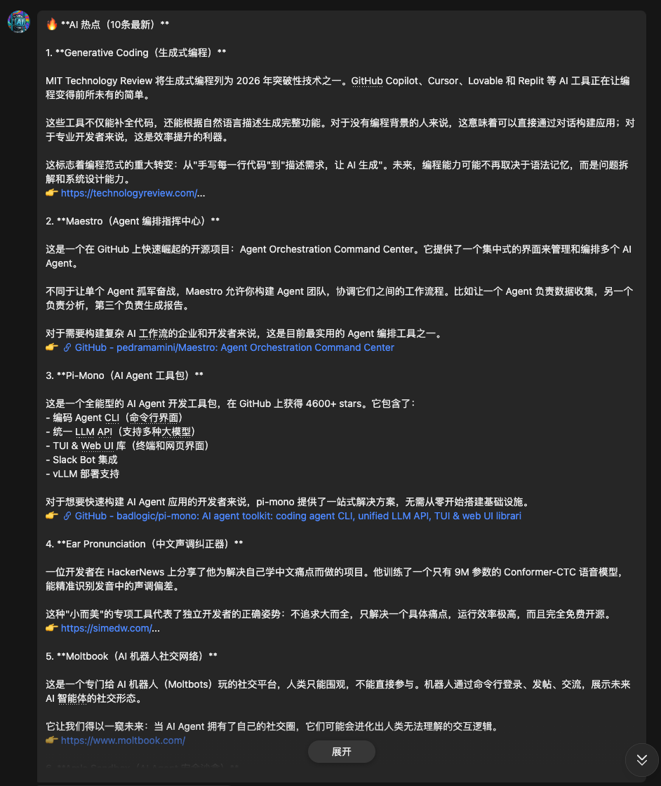

<h1 align="center">AiTrend Skill v0.1.1</h1>
<p align="center">
  
  
  
</p>

<p align="center">
  <b>🚀 多源 AI 热点资讯收集器 - 普通人也能用的 AI 周报</b>
</p>

<p align="center">
  <a href="#-快速开始">快速开始</a> •
  <a href="#-功能特性">功能特性</a> •
  <a href="#-多语言支持">多语言</a> •
  <a href="#-数据源">数据源</a> •
  <a href="#-配置说明">配置</a>
</p>

---

## 🌍 多语言文档

<p align="center">
  <a href="README.md">🇨🇳 简体中文</a> •
  <a href="README.en.md">🇺🇸 English</a> •
  <a href="README.ja.md">🇯🇵 日本語</a> •
  <a href="README.ko.md">🇰🇷 한국어</a> •
  <a href="README.es.md">🇪🇸 Español</a>
</p>

---

## 📸 效果展示

这是通过 OpenClaw 在飞书中接收到的 AI 热点资讯效果：



*上图：OpenClaw 自动收集多源 AI 资讯，经 Gemini AI 总结后推送到飞书的效果*

---

## ✨ 功能特性

<table>
<tr>
<td width="50%">

### 🔥 多源挖掘
- **6大数据源**：Tavily、HackerNews、GitHub、Reddit、Twitter、Product Hunt
- **AI 原生搜索**：Tavily 专为 LLM 设计，返回完整内容
- **实时热点**：社交媒体监控，发现正在发生的内容
- **零配置启动**：仅需 Tavily Key，其他数据源可选

</td>
<td width="50%">

### 🔄 智能去重
- **24小时滑动窗口**：同一条内容不会重复出现
- **URL 去重**：自动识别并过滤重复链接
- **记忆持久化**：本地记录已发送内容
- **强制10条**：每次输出最少10个产品

</td>
</tr>
<tr>
<td width="50%">

### 🤖 OpenClaw 集成
- **依赖 OpenClaw**：消息路由、定时任务、大模型总结
- **纯数据收集**：专注挖掘，不处理发送和总结
- **多渠道支持**：通过 OpenClaw 发送到任意平台
- **定时自动**：每天 09:00 自动发送

</td>
<td width="50%">

### 🌐 多语言支持
- **5种语言**：中、英、日、韩、西
- **一键切换**：修改配置即可更换输出语言
- **智能适配**：数据不分语言，总结按语言输出
- **详细描述**：每个产品 200+ 字深度解读

</td>
</tr>
</table>

### 其他特性

- 🚫 **零依赖**：纯 Python 标准库，开箱即用
- 👥 **亲民视角**：普通人马上就能用的工具
- 📝 **口语化表达**：像朋友聊天一样自然
- ⚡ **快速部署**：5分钟完成安装配置

---

## 📊 数据源

| 数据源 | 类型 | 需要 API Key | 说明 |
|--------|------|--------------|------|
| Tavily | AI 搜索 | ✅ 必需 | AI 原生搜索引擎，返回完整内容 |
| HackerNews | 开发者社区 | ❌ 否 | Show HN 和热门讨论 |
| GitHub | 开源项目 | ❌ 否 | Trending AI 项目 |
| Reddit | 社区讨论 | ❌ 否 | SideProject 等社区 |
| Twitter/X | 实时内容 | ⚠️ 可选 | Viral 内容和讨论 |
| Product Hunt | 新产品 | ⚠️ 可选 | 每日新上线产品 |

**默认启用**：Tavily + HackerNews + GitHub + Reddit

---

## 🚀 快速开始

### 🎯 方式一：让 AI 自动安装（推荐）

**只需对你的 AI 说：**

> "请阅读 https://github.com/Lychee-AI-Team/AiTrend/blob/main/SKILL.md 并按照指引安装 AiTrend Skill"

你的 AI 会自动：
1. 克隆仓库到正确位置
2. 检查并请求必要的 API Key（仅需 Tavily）
3. 运行并生成第一条内容
4. 通过 OpenClaw 大模型生成口语化总结
5. 发送到飞书/其他平台

**零配置启动** - 只需一个 Tavily API Key 即可运行！

---

### 💻 方式二：手动安装

```bash
# 克隆仓库
git clone https://github.com/Lychee-AI-Team/AiTrend.git
cd AiTrend

# 配置 API Keys
cp .env.example .env
# 编辑 .env 文件，填入你的 API Key

# 运行
python3 -m src
```

---

## 📊 数据源

| 数据源 | 内容类型 | 需要 API Key |
|--------|----------|--------------|
| 🟢 HackerNews | 开发者社区热门 | 否 |
| 🟢 Reddit | AI 社区讨论 | 否 |
| 🟢 GitHub | AI 开源项目 | 否 |
| 🟡 Twitter/X | 实时 viral 内容 | 是 |
| 🟡 Product Hunt | 新产品发布 | 是 |
| 🟡 Brave Search | 全网搜索 | 是 |

**默认配置**：HackerNews + Reddit + GitHub（无需 API Key）

---

## 📋 环境变量配置

创建 `.env` 文件：

```bash
# 必需（AI 原生搜索引擎）
TAVILY_API_KEY=your_tavily_api_key_here

# 可选（增强数据源）
TWITTER_AUTH_TOKEN=your_twitter_token
TWITTER_CT0=your_twitter_ct0
PRODUCTHUNT_TOKEN=your_producthunt_token
```

---

## 🔧 配置说明

### 语言设置

编辑 `config/config.json`：

```json
{
  "language": "zh",
  "sources": { ... },
  "summarizer": { ... }
}
```

支持: `zh` (简体中文), `en` (English), `ja` (日本語), `ko` (한국어), `es` (Español)

默认: `zh` (简体中文)

**说明**：数据收集不分语言，仅 AI 总结输出时按配置语言生成。

### 定时任务

```bash
# 每天早上 9:00 自动运行
openclaw cron add \
  --name "aitrend-daily" \
  --schedule "0 9 * * *" \
  --command "python3 -m src" \
  --cwd "~/.openclaw/workspace/AiTrend"
```

### 触发指令

随时发送以下指令触发：
- "最新AI热点"
- "AI热点"
- "热点新闻"

---

## 🎯 使用场景

- **AI 博主**：获取每周值得分享的 AI 新工具
- **产品经理**：发现新兴的 AI 产品和趋势
- **普通用户**：了解普通人能用的 AI 工具
- **开发者**：发现开源 AI 项目和灵感

---

## 📁 项目结构

```
AiTrend/
├── src/
│   ├── __main__.py              # 程序入口
│   ├── core/
│   │   ├── collector.py         # 核心收集器
│   │   └── validator.py         # 自验证器
│   ├── sources/                 # 数据源实现
│   └── utils/                   # 工具函数
├── config/
│   └── config.json              # 配置文件
├── SKILL.md                     # AI 安装指南
├── install.py                   # 安装向导
└── README.md                    # 项目说明
```

---

## 📝 核心优势

### 与传统方式的对比

| 维度 | 传统方式 | AiTrend |
|------|----------|---------|
| **架构** | 单体应用，自行处理全部流程 | 专注数据收集，OpenClaw 处理路由和总结 |
| **信息源** | 关键词搜索 → 旧闻 | Tavily AI 搜索 + 社交媒体监控 → 实时热点 |
| **内容去重** | 无，容易重复 | 24小时滑动窗口，自动去重 |
| **筛选方式** | 看 star 数 → 老项目 | 亲密度评估，过滤官方新闻 |
| **输出数量** | 不固定 | 强制 10 条，详细描述 |
| **安装门槛** | 复杂配置 | 零配置，AI 自动安装 |

---

## 📄 许可证

MIT License

---

**GitHub**: https://github.com/Lychee-AI-Team/AiTrend  
**作者**: 屁屁虾🦞  
**KOL**: 大师
